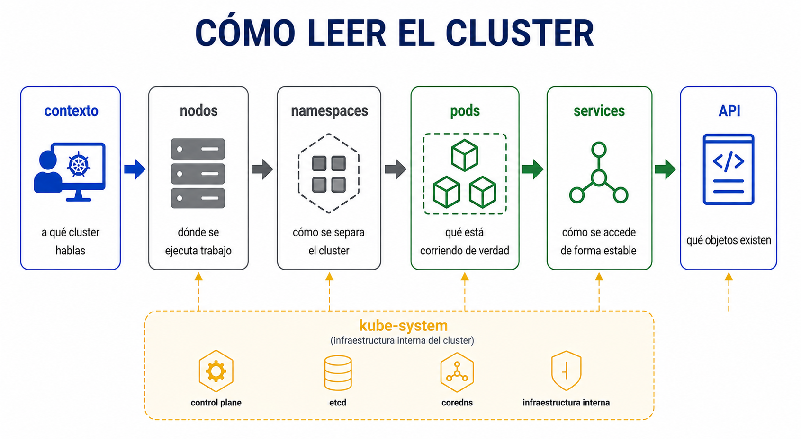
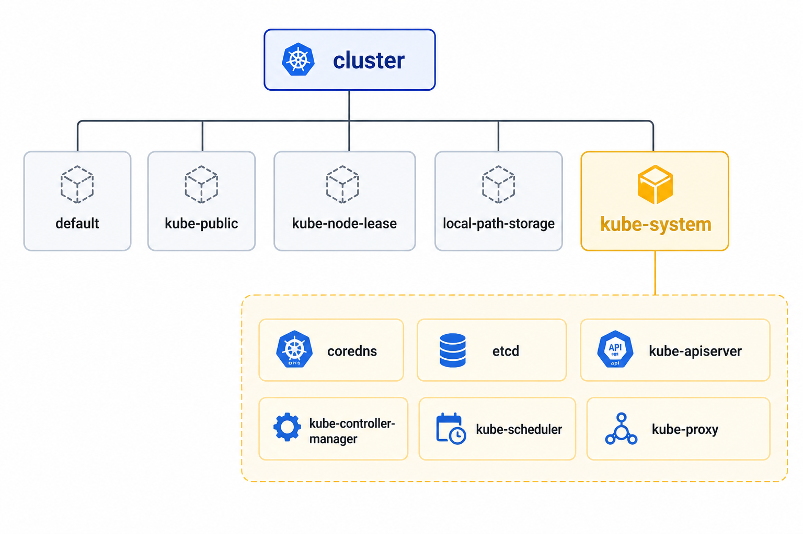

# Beginner 01 - Fundamentos del cluster

## Navegacion

- [🏠 Inicio del repositorio](../../README.md)
- [📘 Inicio de Beginner](../README.md)
- [📑 Índice del módulo](README.md)
- [⬅️ Anterior](README.md)
- [➡️ Siguiente](02_lab.md)

Antes de operar un [cluster](../Conceptos/cluster.md) necesitas aprender a leerlo sin perderte. La idea no es memorizar comandos sueltos, sino entender que cada salida de [`kubectl`](../Conceptos/kubectl-context.md) te enseña una capa distinta del sistema.

Si lo piensas desde la operacion diaria, el orden importa. Primero confirmas que el shell apunta al cluster correcto, porque si el contexto es equivocado todo lo demas queda contaminado. Luego miras los [nodos](../Conceptos/node.md) para saber si el cluster tiene una base sana. Despues separas el espacio de sistema del espacio de usuario con [namespaces](../Conceptos/namespace.md), y solo entonces miras los [pods](../Conceptos/pod.md) que realmente estan corriendo.

| Lo que miras | Qué te responde | Por qué importa |
|---|---|---|
| `kubectl config current-context` | a que cluster hablas | evita leer el cluster equivocado |
| `kubectl get nodes -o wide` | si el control-plane y los nodos estan vivos | te da la base del cluster |
| `kubectl get namespaces` | como esta separado el cluster | distingue sistema, pruebas y recursos de usuario |
| `kubectl get pods -A` | que esta corriendo de verdad | muestra la realidad operativa |
| `kubectl get svc -A` | como se publica el acceso estable | separa acceso de ejecucion |
| `kubectl api-resources` / `kubectl explain` | que objetos existen y como se escriben | te evita depender de memoria |

En [`kube-system`](../Conceptos/namespace.md) vive la infraestructura interna. No es un espacio para tus aplicaciones del lab. Cuando veas [`coredns`](../Conceptos/dns-interno.md), [`etcd`](../Conceptos/cluster.md), [`kube-apiserver`](../Conceptos/api-kubernetes.md), [`kube-controller-manager`](../Conceptos/control-plane.md), [`kube-scheduler`](../Conceptos/control-plane.md) o [`kube-proxy`](../Conceptos/cluster.md), lo que estas viendo no son apps de usuario, sino piezas que mantienen el cluster funcionando. En un entorno como `kind` suele aparecer tambien `kindnet`, que forma parte de la red del propio cluster.

Los otros namespaces ayudan a separar funciones. [`default`](../Conceptos/namespace.md) es el sitio mas simple para pruebas. [`kube-public`](../Conceptos/namespace.md) expone informacion publica del cluster. [`kube-node-lease`](../Conceptos/namespace.md) ayuda a saber si un nodo sigue vivo. `local-path-storage` suele aparecer en kind como una solucion simple de almacenamiento local. Si entiendes esa separacion, leer la salida deja de ser ruido.

La [API de Kubernetes](../Conceptos/api-kubernetes.md) tambien forma parte de esta fotografia. `api-resources` te dice que tipos de objeto existen y si viven dentro de un namespace o a nivel cluster. [`explain`](../Conceptos/api-kubernetes.md) te muestra la forma del objeto, que es justo lo que necesitas cuando no recuerdas un campo de un YAML. Eso es mas util que intentar memorizar la sintaxis completa desde el principio.

| Familia | Ejemplos | Qué debes reconocer |
|---|---|---|
| Computo | [`pods`](../Conceptos/pod.md), [`nodes`](../Conceptos/node.md), [`deployments`](../Conceptos/deployment.md), [`replicasets`](../Conceptos/replicaset.md) | la parte que ejecuta y mantiene replicas |
| Red y acceso | [`services`](../Conceptos/service.md), `endpoints`, `ingresses` | la parte que expone y conecta |
| Configuracion | `configmaps`, `secrets`, `serviceaccounts` | la parte que da entrada y contexto a los pods |
| Estado y observabilidad | [`events`](../Conceptos/events.md), `leases` | la parte que deja pistas de lo que pasa |
| Almacenamiento | `persistentvolumes`, `persistentvolumeclaims`, `storageclasses` | la parte que sostiene datos |

La lectura correcta de este bloque es simple: no tienes que saberlo todo de memoria, pero sí tienes que saber dónde mirar. Si entiendes contexto, [nodos](../Conceptos/node.md), namespaces, pods, [services](../Conceptos/service.md) y [API](../Conceptos/api-kubernetes.md), ya tienes la base para entrar en el resto del lab sin ir a ciegas.

**Errores tipicos**
- mirar solo pods y olvidar contexto y nodo
- confundir `Service` con `Pod`
- pensar que `Running` basta para validar todo
- usar `kubectl` sin saber que recurso estas leyendo

**Qué debes retener**
- el contexto correcto es el primer filtro
- `kube-system` no es para tus apps
- los namespaces separan funciones
- `kubectl explain` es la referencia rapida cuando no recuerdas la forma de un recurso

## ➡️ Siguiente

Continua con [Practica guiada](02_lab.md).
