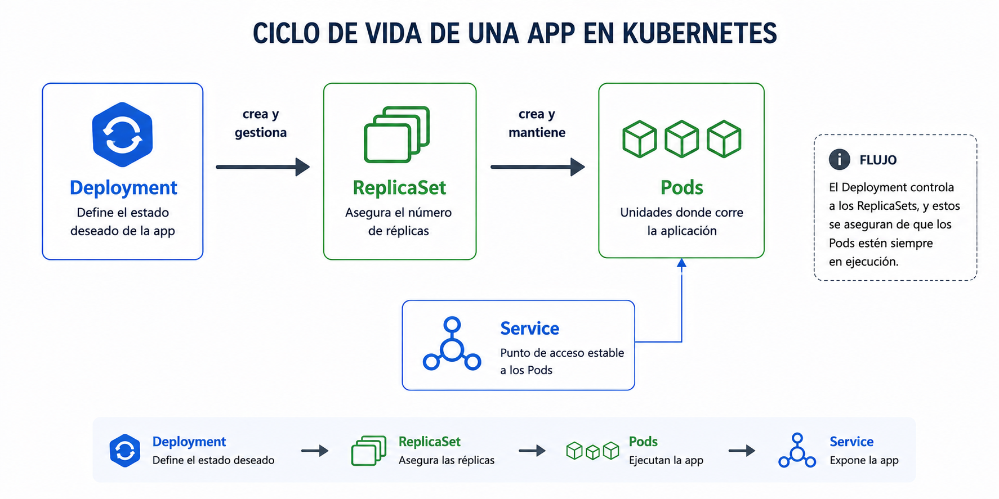

# Beginner 03 - Despliegues imperativos


## Navegacion

- [🏠 Inicio del repositorio](../../README.md)
- [📘 Inicio de Beginner](../README.md)
- [📑 Índice del módulo](README.md)
- [⬅️ Anterior](README.md)
- [➡️ Siguiente](02_lab.md)

Cuando creas una aplicacion en Kubernetes, no piensas solo en [pods](../Conceptos/pod.md). Piensas en el estado que quieres mantener y en cuantas copias necesitas.

La parte de acceso estable con `Service` la veras en el bloque siguiente.

<br>



<br>

La pieza importante aqui es que cada objeto hace un trabajo distinto. El [`Deployment`](../Conceptos/deployment.md) describe el estado deseado y controla los cambios. El [`ReplicaSet`](../Conceptos/replicaset.md) sostiene el numero de copias que deben existir. Los [pods](../Conceptos/pod.md) son la ejecucion real.

| Concepto | Qué representa | Qué debes entender |
|---|---|---|
| [`Deployment`](../Conceptos/deployment.md) | estado deseado | decide cuantas copias debe haber y como evolucionan |
| [`ReplicaSet`](../Conceptos/replicaset.md) | copia controlada | mantiene el numero exacto de pods |
| [`Pod`](../Conceptos/pod.md) | ejecucion real | puede cambiar o recrearse |

<br>

Cuando escalas o actualizas, Kubernetes no inventa una nueva regla cada vez. Reconcilia el estado hasta volver a lo que pediste. Por eso es importante separar lo que se gestiona de forma estable de lo que puede desaparecer y volver a salir. El [pod](../Conceptos/pod.md) puede cambiar; la idea del workload debe seguir viva.

<br>

```text
estado deseado -> reconciliacion -> pods vivos -> acceso estable
```

Si lo llevas a operacion real, la pregunta correcta no es "que pod tengo ahora". La pregunta es "que controlador lo mantiene y cuantos deberia haber". Esa diferencia es la base de casi todo lo que haces despues en Kubernetes.

<br>

**Errores tipicos**
- pensar que el pod es la unidad principal de gestion
- creer que escalar es crear pods a mano
- no comprobar que el [rollout](../Conceptos/rollout.md) termino bien

**Qué debes retener**
- el deployment describe y sostiene el estado deseado
- los pods son la parte que cambia
- Kubernetes reconcilia, no improvisa
- el [rollout](../Conceptos/rollout.md) debe terminar bien antes de seguir

## ➡️ Siguiente

Continua con [Practica guiada](02_lab.md).
