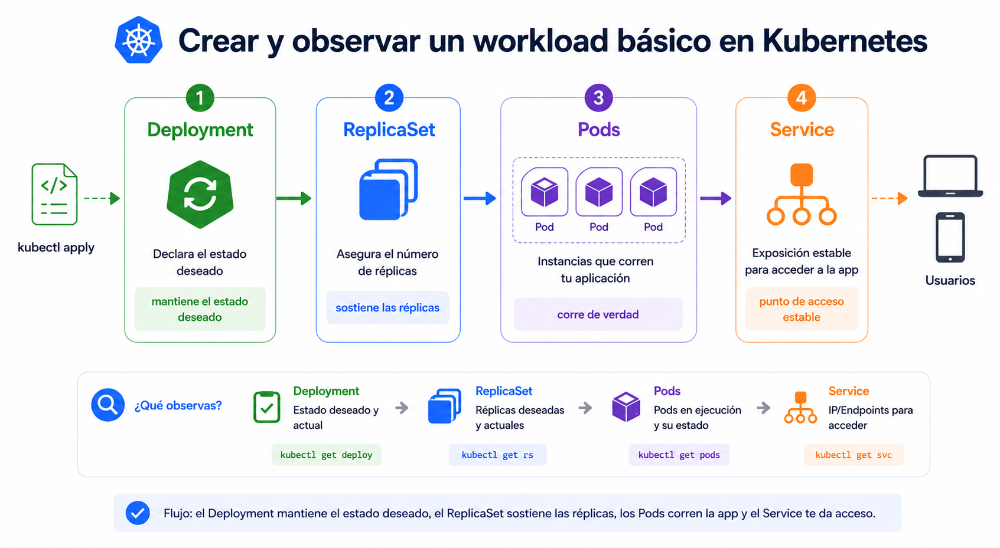

# Beginner 03 - Practica guiada

## Navegacion

- [🏠 Inicio del repositorio](../../README.md)
- [📘 Inicio de Beginner](../README.md)
- [📑 Índice del módulo](README.md)
- [⬅️ Anterior](01_teoria.md)
- [➡️ Siguiente](../04_Workloads_Declarativos/README.md)

## Contexto

Ahora vas a montar un workload real y ver como Kubernetes crea y escala la aplicacion sin que tengas que manejar los pods uno por uno. La parte de acceso estable con `Service` la dejaras para el bloque siguiente.

## Tarea

Empiezas creando el estado deseado con comandos directos. Despues miras como nace el workload y por ultimo escalas para comprobar que la reconciliacion funciona.

```bash
kubectl create deployment hello-k8s --image=nginx:stable
```

Con esto defines la aplicacion base. Lo importante no es la linea exacta, sino que Kubernetes ha aceptado el estado deseado.

```bash
kubectl get deployment,rs,pods -l app=hello-k8s -o wide
```

Ahora observas como aparece el workload. Al principio puedes ver `ContainerCreating`; eso no es un fallo, es parte normal del arranque.

```bash
kubectl scale deployment hello-k8s --replicas=3
kubectl rollout status deployment/hello-k8s
kubectl get pods -l app=hello-k8s -o wide
```

En este punto Kubernetes debe converger al numero de replicas pedido. Si todo va bien, el rollout termina y ves tres pods activos.

| Paso | Qué debes observar |
|---|---|
| crear deployment | el estado deseado existe |
| mirar deployment/rs/pods | el workload empieza a nacer |
| escalar | Kubernetes crea o ajusta replicas |
| rollout status | la convergencia termina bien |


<br>



<br>

## Criterio de salida

La practica queda resuelta cuando puedes crear la app con comandos imperativos, verla nacer y dejarla en tres replicas con un rollout correcto.
<br>

## ➡️ Siguiente

Continua con [Despliegues declarativos](../04_Workloads_Declarativos/README.md).
