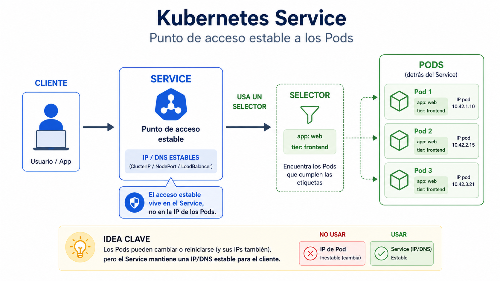
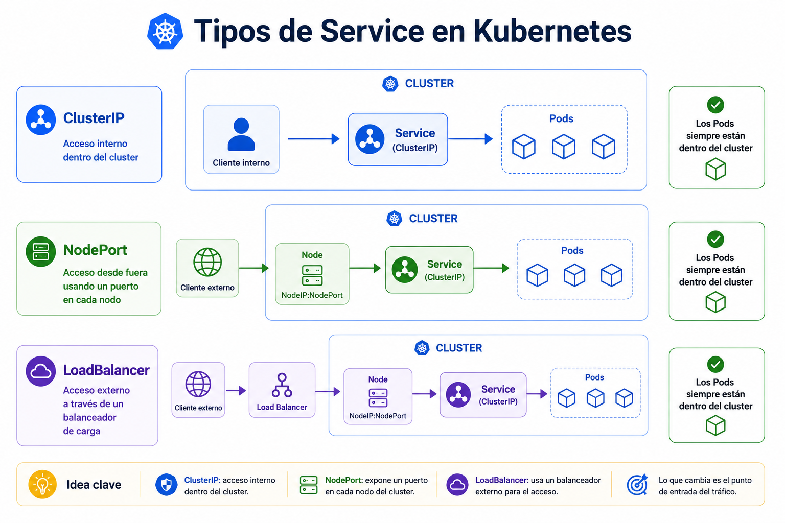

# Beginner 04 - Services y exposicion basica

## Navegacion

- [🏠 Inicio del repositorio](../../README.md)
- [📘 Inicio de Beginner](../README.md)
- [📑 Índice del módulo](README.md)
- [⬅️ Anterior](README.md)
- [➡️ Siguiente](02_lab.md)

Un [`Service`](../Conceptos/service.md) es la capa que mantiene una entrada estable hacia un conjunto de [pods](../Conceptos/pod.md). Los pods pueden cambiar, recrearse o escalar, pero el acceso no deberia romperse por eso.

 

 

La idea importante es que el `Service` no "es" la aplicacion. Es el punto de acceso. El pod ejecuta la carga, el [Deployment](../Conceptos/deployment.md) la sostiene y el `Service` deja una direccion estable para llegar a ella. En Beginner basta con distinguir la diferencia entre ejecucion y acceso.

 

 

Lo normal en un laboratorio local es empezar por [`ClusterIP`](../Conceptos/clusterip.md), porque te enseña la idea basica: el acceso vive aunque el pod cambie. La IP estable pertenece al service, no al pod.

Si entiendes [selector](../Conceptos/selector.md), `ClusterIP` y pods, ya tienes la base para no confundir acceso con ejecucion.

**Errores tipicos**
- pensar que el service ejecuta la app
- confundir la IP del pod con la IP estable
- olvidar que el selector del service decide a que pods apunta
- asumir que todos los tipos de service hacen lo mismo

**Qué debes retener**
- el service da acceso estable
- los pods cambian, el acceso no deberia romperse
- `ClusterIP` es la base del acceso interno
- el selector es la pieza que une service y pods

## ➡️ Siguiente

Continua con [Practica guiada](02_lab.md).
