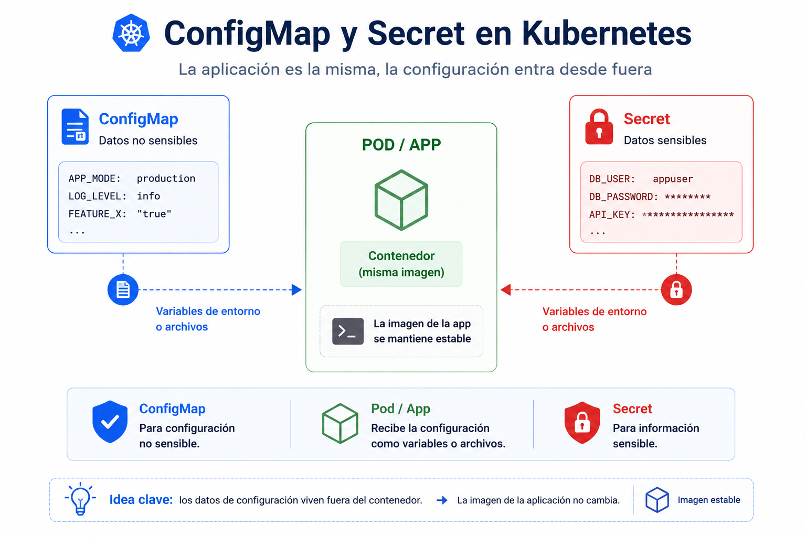

# Beginner 05 - Configuracion basica

## Navegacion

- [🏠 Inicio del repositorio](../../README.md)
- [📘 Inicio de Beginner](../README.md)
- [📑 Índice del módulo](README.md)
- [⬅️ Anterior](README.md)
- [➡️ Siguiente](02_lab.md)

En Kubernetes, la configuracion no deberia quedar incrustada a fuego dentro de la aplicacion. Lo normal es separar lo que cambia de lo que ejecuta, y por eso existen `ConfigMap` y `Secret`.

 

 

Un `ConfigMap` guarda configuracion no sensible. Un `Secret` guarda valores sensibles. Ambos permiten que un workload reciba datos sin tener que modificar la imagen. En Beginner basta con entender esa separacion: la aplicacion corre, la configuracion entra desde fuera.

| Recurso | Qué guarda | Para qué sirve |
|---|---|---|
| `ConfigMap` | valores de configuracion | parametros, nombres, flags |
| `Secret` | datos sensibles | contraseñas, tokens, claves |
| variables de entorno | lectura simple desde el pod | inyectar valores sin editar la imagen |
| volume mount | archivo dentro del contenedor | consumir config como fichero |

 

La idea practica es que el mismo pod puede comportarse distinto segun el valor que reciba. Eso te evita crear una imagen nueva solo por cambiar un nombre de servicio o una contraseña.

Si entiendes esta separacion, ya tienes la base para no mezclar codigo, datos y secretos en el mismo sitio.

**Errores tipicos**
- meter configuracion fija dentro de la imagen
- usar Secret como si fuera un ConfigMap cualquiera
- olvidar que la config puede cambiar sin rehacer la app
- no comprobar como entra el valor al pod

**Qué debes retener**
- `ConfigMap` y `Secret` separan configuracion de ejecucion
- la imagen no deberia cambiar por cada ajuste
- las variables de entorno y los mounts son formas de consumo
- el pod puede recibir comportamiento distinto sin cambiar la imagen

## ➡️ Siguiente

Continua con [Practica guiada](02_lab.md).
