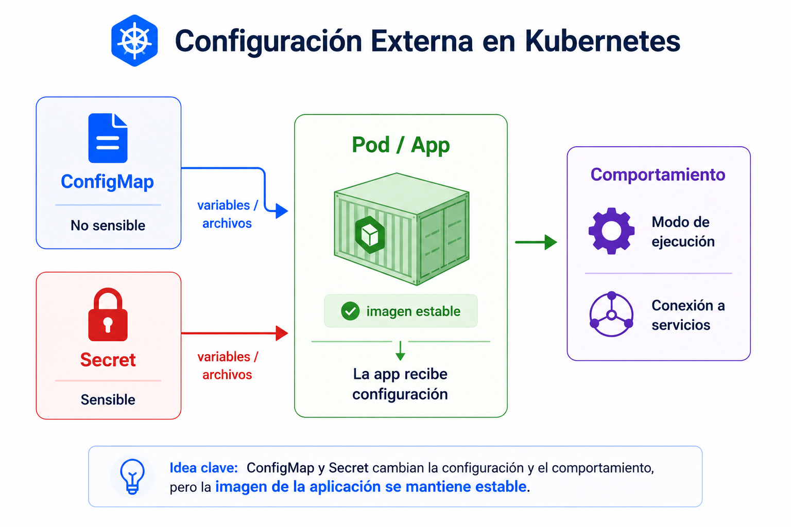

# Beginner 06 - Practica guiada

## Navegacion

- [🏠 Inicio del repositorio](../../README.md)
- [📘 Inicio de Beginner](../README.md)
- [📑 Índice del módulo](README.md)
- [⬅️ Anterior](01_teoria.md)
- [➡️ Siguiente](../07_Almacenamiento_Basico/README.md)

## Contexto

Ahora vas a separar configuracion del contenedor para que veas como una app puede cambiar sin tocar la imagen.

## Tarea

Vas a crear tres archivos YAML:
- `configmap.yaml` para la configuracion no sensible
- `secret.yaml` para la configuracion sensible
- `pod.yaml` para consumir esos valores desde un pod sencillo

Un archivo YAML es un fichero de texto plano donde declaras el estado deseado de un objeto de Kubernetes. No es un script ni un programa: es una descripcion. La indentacion importa, porque Kubernetes lee esa estructura para saber que recurso quieres crear.

Empieza por crear una carpeta de trabajo y entra en ella. Si prefieres `vim` en lugar de `nano`, usa el editor que te resulte mas comodo.

```bash
mkdir -p ~/k8s-beginner/configuracion-basica
cd ~/k8s-beginner/configuracion-basica
```

### 1. Crea el `ConfigMap`

Abre `nano configmap.yaml` y escribe esto:

```yaml
apiVersion: v1
kind: ConfigMap
metadata:
  name: hello-config
data:
  APP_MODE: lab
  APP_NAME: hello-k8s
```

Esto define un objeto que guarda configuracion no sensible. El bloque `data` contiene pares clave/valor que podras pasar al pod despues.

### 2. Crea el `Secret`

Abre `nano secret.yaml` y escribe esto:

```yaml
apiVersion: v1
kind: Secret
metadata:
  name: hello-secret
type: Opaque
stringData:
  APP_TOKEN: secret123
```

Este archivo es igual de declarativo, pero representa datos sensibles. `stringData` te permite escribir el valor en claro y Kubernetes lo guarda en el objeto `Secret`.

### 3. Crea el `Pod`

Abre `nano pod.yaml` y escribe esto:

```yaml
apiVersion: v1
kind: Pod
metadata:
  name: config-check
spec:
  restartPolicy: Never
  containers:
    - name: app
      image: busybox:1.36
      command: ["sh", "-c", "env | sort | grep -E '^APP_'"]
      envFrom:
        - configMapRef:
            name: hello-config
        - secretRef:
            name: hello-secret
```

Este pod no cambia la imagen. Solo consume la configuracion que le llega desde fuera.

### 4. Aplica los archivos

```bash
kubectl apply -f configmap.yaml
kubectl apply -f secret.yaml
kubectl apply -f pod.yaml
```

Con eso declaras los tres recursos en Kubernetes.

### 5. Comprueba el resultado

```bash
kubectl get configmap hello-config -o yaml
kubectl get secret hello-secret -o yaml
kubectl logs config-check
```

Aqui no necesitas memorizar el contenido del `Secret`; basta con ver que Kubernetes lo trata como un objeto distinto y que el pod recibe los valores de configuracion.

| Paso | Qué debes observar |
|---|---|
| crear `ConfigMap` | el archivo define valores no sensibles |
| crear `Secret` | el archivo define datos sensibles |
| crear `Pod` | el pod consume la config desde fuera |
| aplicar archivos | Kubernetes crea los objetos declarados |
| leer salida | los valores `APP_` aparecen en el pod |


<br>



<br>

## Criterio de salida

La practica queda resuelta cuando sabes crear configuracion separada, verla en Kubernetes y comprobar que el pod la consume sin rehacer la imagen.
<br>

## ➡️ Siguiente

Continua con [Almacenamiento basico](../07_Almacenamiento_Basico/README.md).
