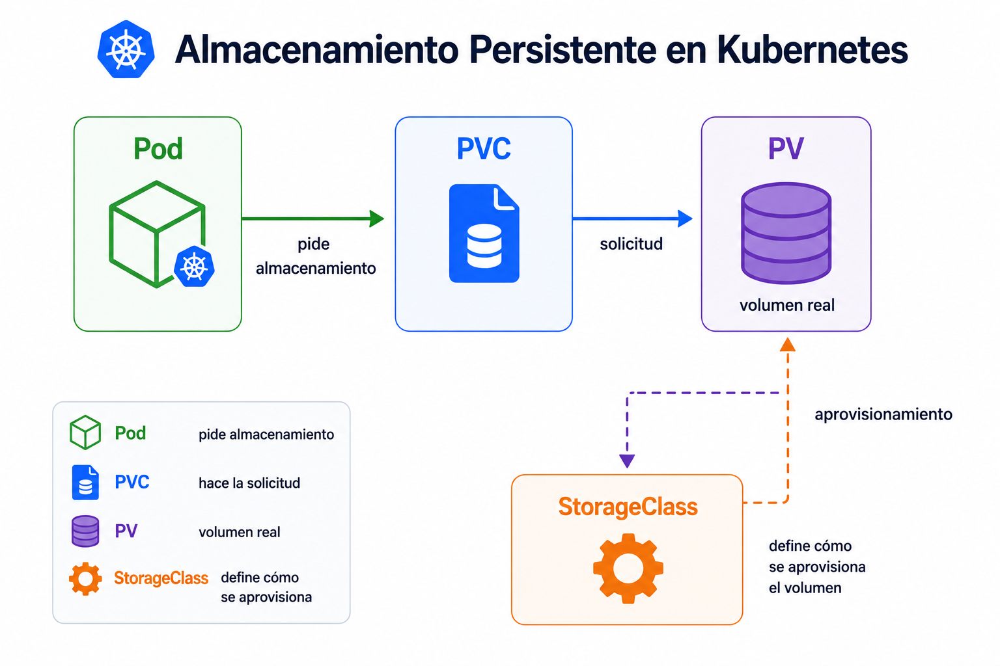

# Beginner 07 - Almacenamiento basico


## Navegacion

- [🏠 Inicio del repositorio](../../README.md)
- [📘 Inicio de Beginner](../README.md)
- [📑 Índice del módulo](README.md)
- [⬅️ Anterior](README.md)
- [➡️ Siguiente](02_lab.md)

Los pods no son un lugar seguro para guardar datos que deban sobrevivir a un reinicio. Por eso Kubernetes separa la ejecucion del almacenamiento persistente con `PV`, `PVC` y `StorageClass`.

<br>



<br>

La idea es sencilla: el `Pod` pide almacenamiento, el `PVC` hace la solicitud y el `PV` representa el volumen disponible. La `StorageClass` define como se aprovisiona ese volumen. En Beginner solo necesitas entender la relacion entre estas piezas y por que no basta con escribir datos dentro del contenedor.

| Recurso | Qué representa | Para qué sirve |
|---|---|---|
| `Pod` | ejecucion efimera | corre la app |
| `PVC` | peticion de almacenamiento | pide volumen |
| `PV` | volumen real | guarda datos |
| `StorageClass` | forma de aprovisionar | define como se crea el volumen |


<br>

Cuando el almacenamiento esta bien planteado, los datos sobreviven al ciclo de vida del pod. Esa es la diferencia entre "se guarda mientras corre" y "se guarda de verdad".

```text
datos en pod -> datos con PVC -> datos persistentes
```

Si lo piensas en operacion, no todos los datos merecen persistencia. Pero cuando hace falta, debes saber pedirla de forma correcta.

**Errores tipicos**
- guardar datos importantes dentro del filesystem efimero del pod
- confundir el PVC con el volumen real
- no revisar la StorageClass disponible
- pensar que el volumen pertenece al pod

**Qué debes retener**
- el pod es efimero
- el PVC pide almacenamiento
- el PV es el volumen real
- la StorageClass define como se crea

## ➡️ Siguiente

Continua con [Practica guiada](02_lab.md).
