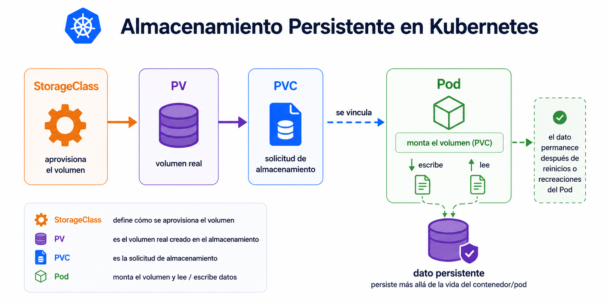

# Beginner 07 - Practica guiada

## Navegacion

- [🏠 Inicio del repositorio](../../README.md)
- [📘 Inicio de Beginner](../README.md)
- [📑 Índice del módulo](README.md)
- [⬅️ Anterior](01_teoria.md)
- [➡️ Siguiente](../08_Debug_Operativo/README.md)

## Contexto

Ya sabes que un pod no es un buen sitio para guardar datos importantes. Ahora vas a pedir almacenamiento persistente y montar un volumen en una app simple.

## Tarea

Vas a crear dos archivos YAML:
- `pvc.yaml` para pedir almacenamiento persistente
- `pod.yaml` para montar ese volumen y escribir un dato

Un archivo YAML es un fichero de texto plano donde declaras el estado deseado de Kubernetes. No es un script ni un programa. Es la forma en la que le dices al cluster qué objeto quieres crear y con qué campos. En este lab usarás ese formato para separar la solicitud de almacenamiento del pod que lo consume.

Empieza por crear una carpeta de trabajo y entra en ella.

```bash
mkdir -p ~/k8s-beginner/almacenamiento-basico
cd ~/k8s-beginner/almacenamiento-basico
```

### 1. Crea el `PVC`

Abre `nano pvc.yaml` o `vim pvc.yaml` y escribe esto:

```yaml
apiVersion: v1
kind: PersistentVolumeClaim
metadata:
  name: hello-pvc
spec:
  accessModes:
    - ReadWriteOnce
  resources:
    requests:
      storage: 1Gi
```

Este archivo solo pide almacenamiento. No crea el volumen real por si mismo; declara la necesidad.

### 2. Crea el `Pod`

Abre `nano pod.yaml` o `vim pod.yaml` y escribe esto:

```yaml
apiVersion: v1
kind: Pod
metadata:
  name: hello-storage
spec:
  restartPolicy: Never
  containers:
    - name: app
      image: busybox:1.36
      command: ["sh", "-c", "echo hola > /data/msg && sleep 3600"]
      volumeMounts:
        - name: data
          mountPath: /data
  volumes:
    - name: data
      persistentVolumeClaim:
        claimName: hello-pvc
```

Este archivo define el pod y le dice qué volumen montar. El dato que escriba el contenedor debe vivir en ese volumen, no solo en la ejecucion del contenedor.

### 3. Aplica los archivos

```bash
kubectl get storageclass
kubectl apply -f pvc.yaml
kubectl apply -f pod.yaml
kubectl wait --for=condition=Ready pod/hello-storage --timeout=60s
```

Antes de continuar, mira qué clase de almacenamiento tienes disponible. En kind suele aparecer `local-path`. Esa clase define como se aprovisiona el volumen que acabara enlazado al `PVC`.

### 4. Comprueba el resultado

```bash
kubectl get pvc hello-pvc
kubectl get pod hello-storage -o wide
kubectl exec hello-storage -- cat /data/msg
```

Si todo va bien, el pod monta el volumen y puedes leer el dato que has escrito.

| Paso | Qué debes observar |
|---|---|
| ver storageclass | sabes qué aprovisionamiento hay |
| crear pvc | aparece la solicitud de volumen |
| crear pod | el pod monta el volumen |
| leer dato | el contenido persiste dentro del volumen |


<br>



<br>

## Criterio de salida

La practica queda resuelta cuando sabes pedir almacenamiento, montarlo en un pod y comprobar que el dato vive en el volumen y no solo en la ejecucion del contenedor.
<br>

## ➡️ Siguiente

Continua con [Debug operativo inicial](../08_Debug_Operativo/README.md).
