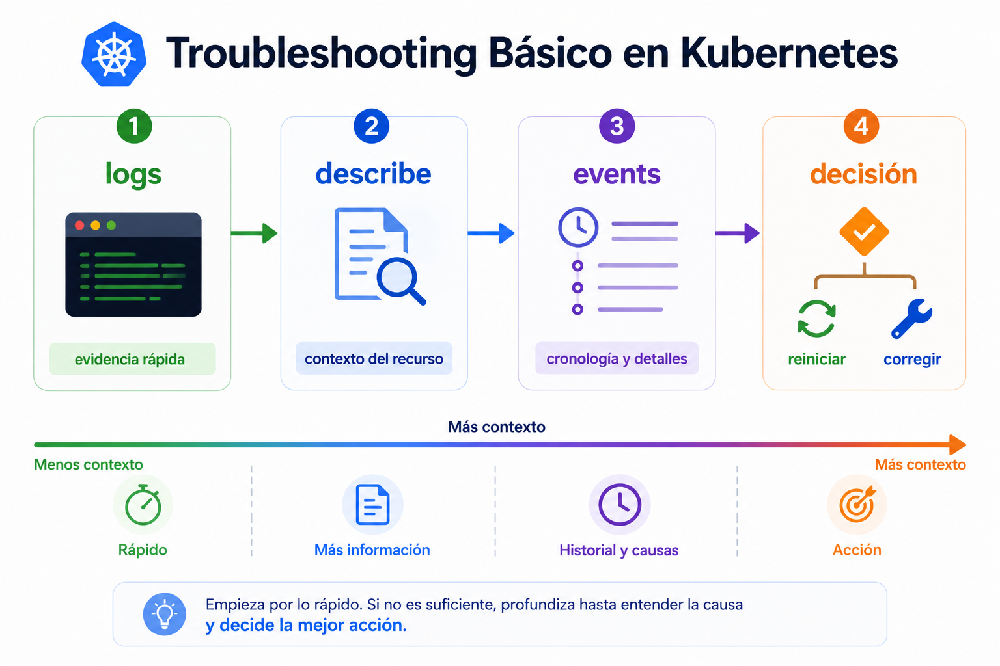

# Beginner 07 - Debug operativo inicial

## Navegacion

- [🏠 Inicio del repositorio](../../README.md)
- [📘 Inicio de Beginner](../README.md)
- [📑 Índice del módulo](README.md)
- [⬅️ Anterior](README.md)
- [➡️ Siguiente](02_lab.md)

Debug operativo es aprender a mirar un fallo sin reaccionar por impulso. En Beginner no buscas resolver incidencias complejas; buscas reconocer la primera evidencia util, entender el estado del [pod](../Conceptos/pod.md) y decidir si reiniciar ayuda o solo tapa el problema.

 

 

La lectura correcta va de menos coste a mas contexto. Primero miras [`logs`](../Conceptos/kubectl-logs.md) porque suelen darte la primera pista. Luego [`describe`](../Conceptos/kubectl-describe.md) para ver el estado del pod, las condiciones y el motivo mas util del fallo. Si sigue sin estar claro, [`events`](../Conceptos/events.md) te ayudan a ordenar lo que ha pasado. Reiniciar solo tiene sentido cuando ya sabes por que lo haces.

| Herramienta | Qué te aporta | Cuándo usarla |
|---|---|---|
| [`logs`](../Conceptos/kubectl-logs.md) | evidencia de ejecucion | primer vistazo |
| [`describe`](../Conceptos/kubectl-describe.md) | estado, causa y condiciones | cuando quieres el motivo mas util |
| [`events`](../Conceptos/events.md) | cronologia de hechos | si la pista aun es incompleta |
| [`rollout`](../Conceptos/rollout.md) | reintento controlado | solo si tiene sentido corregir desde ahi |

 

Cuando entiendes esta secuencia, dejas de tratar un fallo como una emergencia ciega. No todo problema se arregla reiniciando. A veces el pod esta mal configurado, a veces la imagen falla y a veces el estado parece malo solo porque aun no termino de arrancar.

**Errores tipicos**
- mirar logs y parar ahi
- reiniciar antes de entender el error
- asumir que `Running` significa exito total
- no separar sintoma de causa

**Qué debes retener**
- el orden importa
- `logs` te dan la primera pista
- `describe` te da el contexto mas util
- `events` ayudan si sigue faltando contexto
- reiniciar no sustituye a diagnosticar

## ➡️ Siguiente

Continua con [Practica guiada](02_lab.md).
