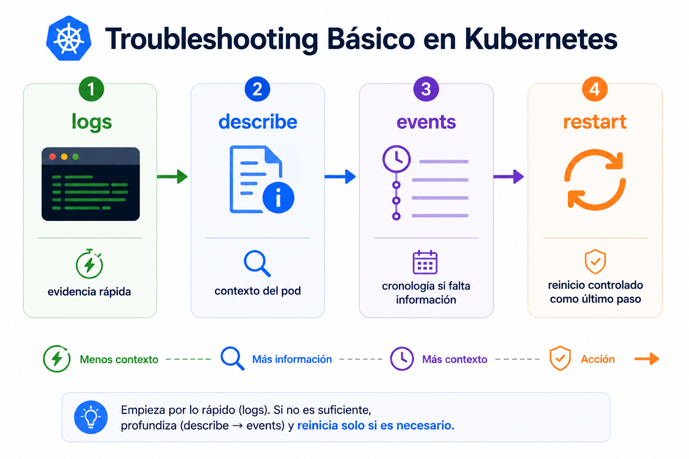

# Beginner 08 - Practica guiada

## Navegacion

- [🏠 Inicio del repositorio](../../README.md)
- [📘 Inicio de Beginner](../README.md)
- [📑 Índice del módulo](README.md)
- [⬅️ Anterior](01_teoria.md)
- [➡️ Siguiente](../09_Repaso_Integrador/README.md)

## Contexto

Vas a romper un workload de forma controlada para aprender a diagnosticarlo sin ir a ciegas.
Trabajaras sobre `hello-declarativo`, el deployment declarativo del bloque anterior, porque ya usa `Recreate` y eso hace mas simple seguir el cambio.

## Tarea

Primero introduces un fallo reproducible editando YAML. Despues lees la evidencia en este orden:
`logs` -> `describe` -> `events`. Por ultimo quitas el fallo y compruebas que el cluster vuelve a converger.

### 1. Abre seguimiento en vivo

Abre una terminal extra y ejecuta esto antes de romper nada:

```bash
kubectl get pods -l app=hello-declarativo -w
```

Así ves en directo cuando el pod cambia de estado.

### 2. Introduce el fallo

Ahora abre el deployment con `kubectl edit`:

```bash
kubectl edit deployment hello-declarativo
```

Dentro del editor, busca el bloque del primer contenedor. Si usas `vi`, pulsa `/` y escribe `nginx:stable` para ir directo a la linea de la imagen. La referencia mas facil es esta:

```yaml
          image: nginx:stable
```

Justo debajo, añade este bloque:

```yaml
          command:
            - sh
            - -c
            - echo fallo intencional; exit 1
```

Ese `command` fuerza al contenedor a salir con error. El pod deberia pasar a `CrashLoopBackOff` o a una secuencia equivalente de fallos de arranque.

Guarda y sal del editor. Para cuando veas el fallo reproducido, corta la vista con `Ctrl+C`.

### 3. Mira primero `logs`

```bash
kubectl logs -l app=hello-declarativo --previous --tail=50
```

Aqui deberias ver el mensaje `fallo intencional` y la salida final del contenedor antes de morir.

### 4. Baja a `describe`

```bash
kubectl describe pod -l app=hello-declarativo
```

En esta salida busca:
- `State: Waiting` o `State: Terminated`
- `Reason: CrashLoopBackOff`
- el `Last State`
- la causa exacta del ultimo fallo

### 5. Revisa `events`

```bash
kubectl get events --sort-by=.metadata.creationTimestamp
```

En los eventos deberias ver pistas como:
- `Killing`
- `BackOff`
- `Failed`

Si quieres centrarte en la cronologia mas reciente, vuelve a lanzar el comando despues de unos segundos para ver como evolucionan los eventos del mismo fallo.

### 6. Quita el fallo y verifica

```bash
kubectl edit deployment hello-declarativo
kubectl rollout status deployment/hello-declarativo
kubectl get pods -l app=hello-declarativo -o wide
```

En el mismo sitio, borra el bloque `command:` que añadiste y guarda. El deployment vuelve a su estado normal y Kubernetes recrea el pod sano.

| Paso | Qué debes observar |
|---|---|
| abrir el seguimiento | ves el cambio de estado en vivo |
| editar con `kubectl edit` | el pod entra en fallo reproducible |
| `logs` | aparece la salida del error |
| `describe` | ves `CrashLoopBackOff` y el ultimo estado |
| `events` | aparecen `Failed`, `Killing` o `BackOff` |
| quitar `command` con `kubectl edit` | el deployment vuelve a converger |

<br>



<br>

## Criterio de salida

La practica queda resuelta cuando sabes romper un workload de forma controlada, leer la primera evidencia util en `logs`, confirmar el estado con `describe`, revisar la cronologia con `events` y devolverlo a un estado sano sin ir a ciegas.

<br>

## ➡️ Siguiente

Continua con [Repaso integrador](../09_Repaso_Integrador/README.md).
